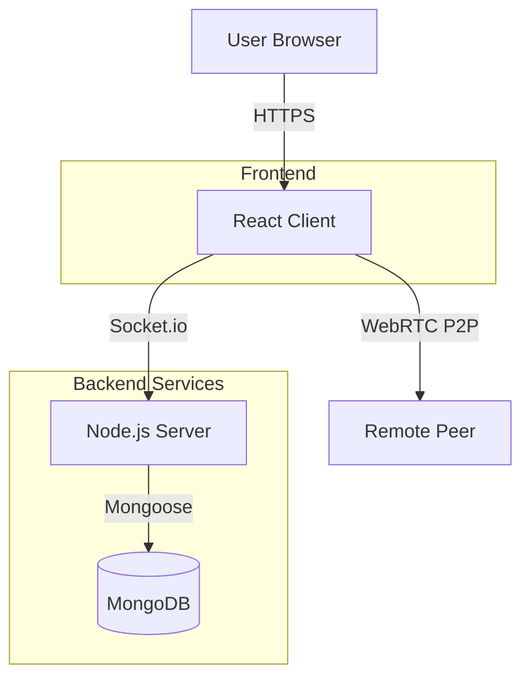

# LayzeeChat

**LayzeeChat** is a modern, responsive, and anonymous video/text chat platform. Connect with strangers effortlessly.

## 🚀 Tech Stack

- **Frontend**: React.js + Tailwind CSS (Vite)
- **Backend**: Node.js + Express
- **Real-time**: WebRTC + Socket.io
- **Database**: MongoDB
- **Deployment**: Docker + Google Cloud (Planned)

## 📂 Structure

- `/client`: React Frontend
- `/server`: Node.js Backend

## 🏗 Architecture



## 🛠 Setup & Run

### Prerequisites
- Node.js (v18+)
- Docker (optional)
- MongoDB (local or Atlas)

### 🏃 Running Locally

1. **Backend**:
   ```bash
   cd server
   npm install
   # Ensure MongoDB is running locally on port 27017
   npm run dev
   ```

2. **Frontend**:
   ```bash
   cd client
   npm install
   npm run dev
   ```

3. Open `http://localhost:5173` in your browser.

### 🐳 Running with Docker

1. Ensure Docker Desktop is running.
2. Run:
   ```bash
   docker-compose up --build
   ```
3. Open `http://localhost` (port 80 mapped to client).

## 🛡 Features
- Random Video/Text Chat
- "Next" button to skip users
- Message filtering (safety)
- Report user functionality
- Dark/Light mode
